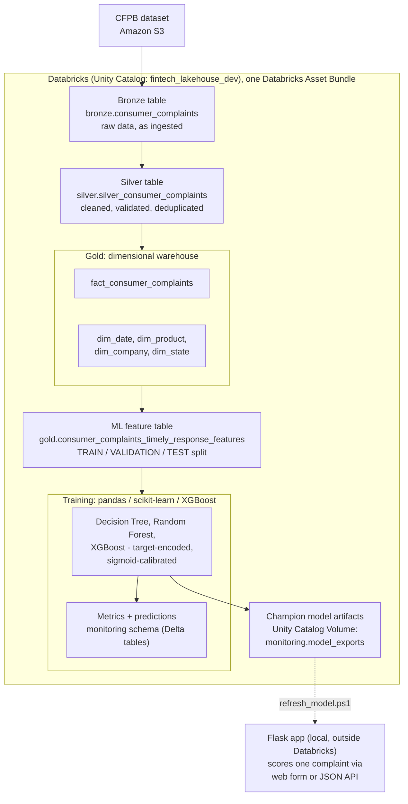

# Consumer Complaints Lakehouse and ML Pipeline

Ingests the CFPB Consumer Complaint Database, builds a Bronze/Silver/Gold lakehouse on Databricks
with Unity Catalog, trains a model to predict untimely complaint responses, and serves it through
a local Flask app.

## Architecture



Two Databricks Jobs, defined in `databricks.yml`: one runs Bronze/Silver/Gold, the other builds
the ML feature table and trains. Flask is the only piece that runs outside Databricks.

## Ingestion

`ingestion/consumer_complaints/download_to_s3.py` downloads the CFPB ZIP and uploads it to S3.

```powershell
$env:S3_BUCKET_NAME = "your-bucket-name"
python ingestion\consumer_complaints\download_to_s3.py
```

## Data engineering: Bronze, Silver, Gold

`.py` scripts under `databricks/src/` are the production entry points. Matching notebooks under
`databricks/notebooks/` mirror the same logic. Catalog: `fintech_lakehouse_dev`.

- **Bronze** (`src/bronze/`): raw CSV from S3, written mostly unchanged.
- **Silver** (`src/silver/`): cleaned, typed, deduplicated. Validation SQL in `databricks/sql/silver/`.
- **Gold** (`src/gold/`): dimensional warehouse. `fact_consumer_complaints` plus `dim_date`,
  `dim_product`, `dim_company`, `dim_state`. Validation in `databricks/sql/gold/`.

## Machine learning

**Feature engineering** (`src/ml/consumer_complaints_ml_features.py`): joins Gold into one
complaint-level table, derives the `label_untimely_response` target, writes a TRAIN/VALIDATION/TEST
split.

**Training** (`src/ml/consumer_complaints_ml_train.py`): pandas/scikit-learn/XGBoost, not Spark
ML (this workspace's serverless compute doesn't reliably support `pyspark.ml`).

- Target encoding for categoricals, out-of-fold on TRAIN.
- Class weighting for the rare positive class (~0.6%), sigmoid calibration afterward.
- Decision threshold picked on a validation-only recall floor (75%).
- Decision Tree, Random Forest, XGBoost compared by validation AUC-PR; best one exported as champion.
- TEST is only touched for final reporting.

**Model artifacts**: `champion_model.joblib` + `serving_metadata_champion.json`, written together
to a Unity Catalog Volume with `joblib.dump()` and plain JSON. No MLflow.

## Model serving: Flask app

`flask_app/app.py` loads `champion_model.joblib` + `serving_metadata.json` and exposes:

- `GET /`: form, built from the serving metadata.
- `POST /predict`: JSON in, target-encoded, prediction out.
- `GET /health`: model/metadata load check.

**Refresh the model:**

```powershell
cd flask_app
.\refresh_model.ps1
```

**Run it:**

```powershell
cd flask_app
python -m venv .venv
.venv\Scripts\Activate.ps1
pip install -r requirements.txt
python app.py
```

Open `http://localhost:5000`, or call `POST /predict` directly. Details in `flask_app/README.md`.

## Databricks Asset Bundle

```powershell
databricks bundle validate --profile consumer-complaints-dev -t dev
databricks bundle deploy --profile consumer-complaints-dev -t dev
databricks bundle run consumer_complaints_bronze_job -t dev --profile consumer-complaints-dev
databricks bundle run consumer_complaints_ml_job -t dev --profile consumer-complaints-dev
```

Only `databricks/src/**/*.py` and `databricks/notebooks/**/*.ipynb` sync to the workspace.
`flask_app/`, `docs/`, `tests/`, `ingestion/` are excluded.

## Repository structure

```
ingestion/consumer_complaints/       S3 ingestion script
tests/                               Unit tests
databricks/
  notebooks/                         Interactive notebooks
  src/{bronze,silver,gold,ml}/       Production entry points
  sql/{silver,gold}/                 Validation SQL
  resources/                         Databricks Job definitions
flask_app/
  app.py, templates/, model/, requirements.txt
docs/screenshots/gold/
databricks.yml
```

## Setup

1. **Ingestion** (root `requirements.txt`): Python 3.11+, AWS credentials, `S3_BUCKET_NAME`.
2. **Databricks**: no local env to run the pipelines, just a CLI profile to deploy/trigger jobs.
3. **Flask** (`flask_app/requirements.txt`): its own venv.

```powershell
python -m unittest discover -s tests -v
```

Runs the ingestion tests, skips the ML/Flask ones. To run those, use the Flask venv:

```powershell
flask_app\.venv\Scripts\python.exe -m unittest tests.test_consumer_complaints_ml_train -v
flask_app\.venv\Scripts\python.exe -m unittest tests.test_flask_app -v
```

`test_flask_app.py` includes a smoke test for `champion_model.joblib` vs `serving_metadata.json`
drift. Needs `flask_app\refresh_model.ps1` run first.

## Tradeoffs

- Recall floor (75%) is a confirmed decision: a missed untimely complaint costs more than an
  over-flagged one, so thresholds target recall over precision. Precision at that level is ~14-16%.
- No narrative text features yet, only a binary "has narrative" flag.
- Hyperparameters are fixed by hand by default; `ENABLE_HYPERPARAMETER_TUNING` runs `GridSearchCV`
  instead. Verified on Databricks, improved AUC-PR, left off by default pending more runs.
- No automated retraining or drift monitoring; training is a manually triggered job.
